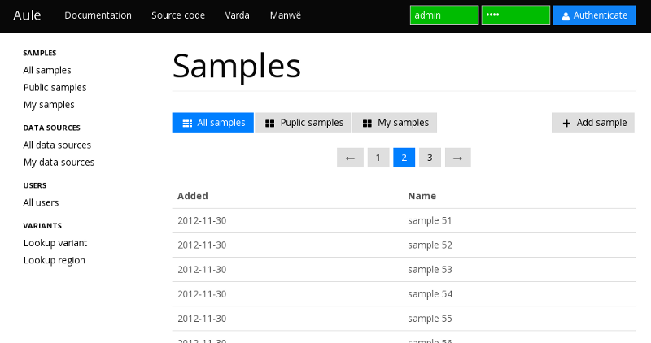

Aulë
====

A web interface to the [Varda](https://github.com/martijnvermaat/varda)
database for genomic variation frequencies.

**Warning:** This is a work in progress, probably not yet ready for use!

Implementation
--------------

Aulë is a client-side JavaScript-driven interface implemented in
[CoffeeScript](http://coffeescript.org/) on top of the
[Sammy.js](http://sammyjs.org/) framework and can be served entirely as
static files. [RequireJS](http://requirejs.org/) is used for modularity and
[Handlebars](http://handlebarsjs.com/) for templates.

The HTML5 layout is based on Twitter's
[Bootstrap](http://twitter.github.com/bootstrap/) with the
[Bootswatch Mono](http://bootswatch.com/cosmo/) theme and uses
[Less](http://lesscss.org/)
stylesheets. [Font Awesome](http://fortawesome.github.io/Font-Awesome/) is
used for icons.

Installation and configuration
------------------------------

Start by getting the source code:

    git clone https://github.com/martijnvermaat/aule.git
    git submodule init
    git submodule update

Now have a look at `web/scripts/config.coffee` and modify according to your
needs.

Since communication between Aulë and Varda is subject to the
[Same origin policy](http://en.wikipedia.org/wiki/Same_origin_policy), both
must be served from the same site (though see the Todo note on CORS below).

The easiest way to serve Aulë is by configuring Varda to do this for
you. Please see the
[Varda documentation](https://varda.readthedocs.org/en/latest/config.html#http-server-settings)
for details.

Another option is to configure a web server to reverse-proxy requests for
Varda and serve the static Aulë files directly. An example
[nginx](http://nginx.org/) configuration:

    upstream varda {
        server 127.0.0.1:5000;
    }

    server {
        listen 443;
        location /aule {
            root /var/www/aule/web;
            try_files $uri /index.html;
        }
        location / {
            proxy_pass http://varda/;
        }
    }

Todo
----

* [Implement Cross-origin resource sharing](http://en.wikipedia.org/wiki/Cross-origin_resource_sharing)
  (CORS) to enable serving Aulë and Varda from different sites.
* Get rid of the hard-coded absolute paths (starting with `/aule`) in
  `web/index.html`. This is tricky, since the path of the request may contain
  any number of directory levels.
* Use git submodules for more of the vendor JavaScript modules.
* Pre-compile Less, CoffeeScript, and Handlebars files, and use minified
  versions of JavaScript files.

Copyright
---------

Manwë is licensed under the MIT License, see the LICENSE file for details. See
the AUTHORS file for a list of authors.
